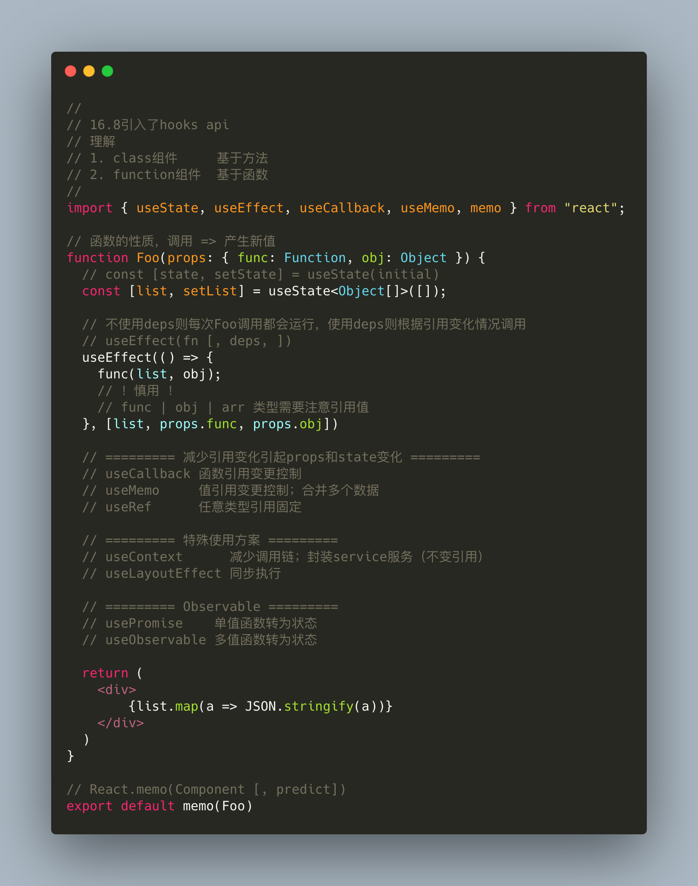

# 问题

## 现象

- 卡顿比较明显
- 内存占用较高
- cpu 占用较高
- 偶尔出现崩溃
- ...

## Devtools 分析

# 影响性能的原因

## 浏览器

现代浏览器性能已经很好了，一般来说我们认为机器性能是够的。

- 硬件分析：用户电脑环境配置、同时开启的应用数目
- Performance：定制一系列操作，查看各部分的运行情况
- Memory：内存快照，提取关键词

## JavaScript

- package.json：关注你引用的包，是否存在 bug
- 系统耗费内存的值：对象、数组、类型数组（Blob 文件）、映射（Map）、集合（Set）等
- 系统耗费计算的过程：递归嵌套、循环嵌套、序列化和反序列化
- 其他：同步计算

## React

- 生命周期
- hooks：副作用控制、useRef
- 重复渲染：控制 props 和 state 的刷新

## Hooks

# 谢谢
