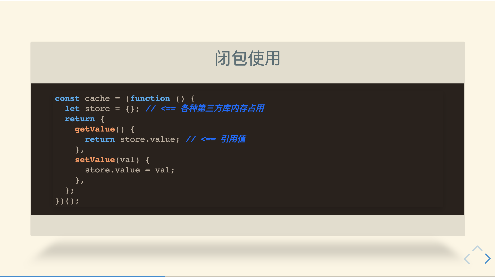

# 一个 Pandoc+Reveal.js 示例

## 特性

- [x] 样式配置
- [x] 热更新
- [x] 模板简单，直接上手




## 使用方式

前提条件

```
# 需要本机安装pandoc
brew install pandoc
# 克隆此项目到你的本地
git clone https://github.com/WanderHuang/simple-slides
# 进入你的项目
cd simple-slides
# 安装
npm install
# 启动
npm start
```

## 配置

`pandoc.config.json`文件配置

```
incremental {boolean} 是否渐进显示列表
theme {string} 主题色。选项black | white | league | beige | sky | night | serif | simple | solarized
transition {string} 过渡效果 选项none | fade | slide | convex | concave | zoom
highlight 代码高亮效果 选项pygments | tango | espresso | zenburn | kate | monochrome | breezedark | haddock
width {number} 内容宽度
height {number} 内容高度

```

### 主题色

- black 高级黑
- white 纯白
- league 渐变黑灰
- beige 渐变米黄
- sky 渐变青蓝
- night 纯黑
- serif 灰色
- simple 简单白
- solarized 黄白，护眼

## 规则

markdown 规则

- `# xxx` 一级菜单
- `## xxx` 往下翻页菜单
- `% xxx` 主题首页内容、日期
- `---` 开启新的幻灯片

### 渐进显示语法

```markdown
::: incremental

- 列表数据 1
- 列表数据 2
- 列表数据 3

:::
```

或者

```markdown
> - 列表数据 1
> - 列表数据 2
> - 列表数据 3
```

### 暂停

```
暂停前

. . .

暂停后
```

### 幻灯片添加背景

```
## 标题 {data-background-image="/path/to/image"}
```

### 演讲者备注

```
::: notes
备注信息
- 下雪
- 天晴
:::
```

按 S 键可以唤醒查看备注

### pandoc 规则

需要查看 pandoc 文档

